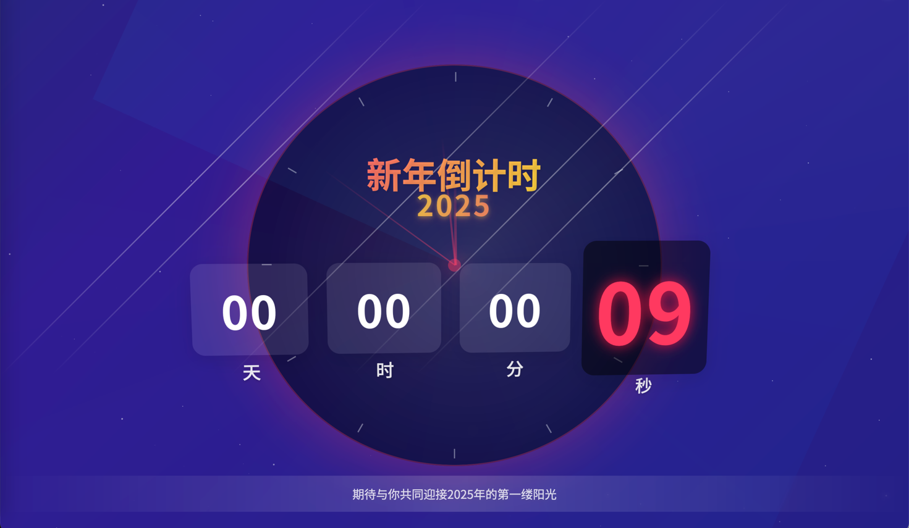

# 新年烟花

实现新年倒计时后放烟花的效果

预览地址：https://zzhougy.github.io/NewYearFireworks/




## 快速开始

### 系统要求

- Python 3（推荐）：https://www.python.org/downloads/
  - 安装时请勾选 "Add Python to PATH"
- 或 Node.js：https://nodejs.org/

### Windows 用户

#### 方法一：使用启动脚本（推荐）

1. 双击运行 `启动服务器.bat`
2. 浏览器会自动打开 `http://localhost:8000`

#### 方法二：手动启动服务器

如果你已安装 Python 3：

```bash
python -m http.server 8000
```

然后在浏览器中访问 `http://localhost:8000`

### Mac 用户

#### 方法一：使用启动脚本（推荐）

1. 在 Finder 中找到 `启动服务器.sh` 文件
2. 右键点击，选择 "打开方式" > "终端"
3. 如果提示无法验证，点击 "打开"
4. 浏览器会自动打开 `http://localhost:8000`

**首次使用需要添加执行权限：**

```bash
chmod +x 启动服务器.sh
```

#### 方法二：手动启动服务器

打开终端，运行：

```bash
python3 -m http.server 8000
```

然后在浏览器中访问 `http://localhost:8000`

## 说明

- 本项目基于 [Firework_Simulator](https://github.com/NianBroken/Firework_Simulator) 进行二次开发

## 为什么需要服务器？

由于浏览器的安全策略（CORS），直接双击HTML文件（file://协议）无法加载音频文件。使用HTTP服务器可以确保所有资源正常加载。

